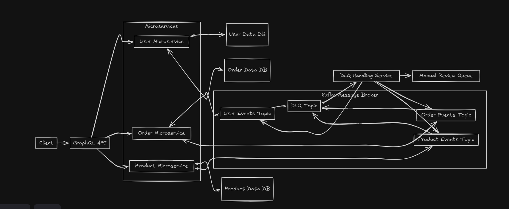

# Microservices E-Commerce Application

## Overview
This project is a microservices-based e-commerce application consisting of User Service, Product Service, Order Service, and a GraphQL Gateway. It uses Kafka for event-driven communication between services and MongoDB for data storage.


## Flow Diagram


## Key Features
- User registration and authentication
- Product management and inventory
- Order processing and management
- GraphQL API for client applications
- Event-driven communication using Kafka
- Custom Dead Letter Queue (DLQ) for handling failed messages


## Architecture
- User Service: Manages user registration, authentication, and profiles
- Product Service: Handles product management and inventory
- Order Service: Processes and manages orders
- GraphQL Gateway: Provides a unified API for client applications
- Kafka: Used for inter-service communication
- DLQ Service: Manages messages that fail processing
- MongoDB: Database for all services

## Prerequisites
- Docker
- Docker Compose

## Quick Start

1. Clone the repository:
   ```
   git clone https://github.com/mittal-sudhanshu/ecommerce
   cd ecommerce
   ```

2. Start the services:
   ```
   docker-compose up -d
   ```

3. The services will be available at:
   - GraphQL Gateway: http://localhost:4000
   - User Service: http://localhost:5000
   - Product Service: http://localhost:5002
   - Order Service: http://localhost:5001
   - Dlq Service: http://localhost:8000

## Service Specific READMEs
- [User Service](./user-service/README.md)
- [Product Service](./product-service/README.md)
- [Order Service](./order-service/README.md)
- [GraphQL Gateway](./graphql-gateway/README.md)
- [DLQ Service](./dlq-service/README.md)
