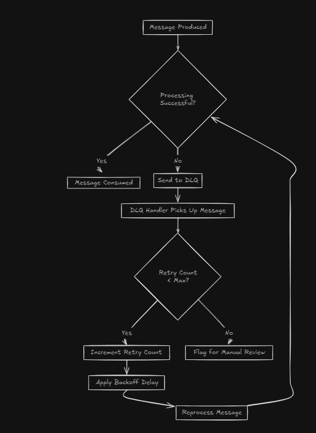

# DLQ Handling Service

## Overview
The DLQ (Dead Letter Queue) Handling Service is responsible for managing messages that fail processing in our Kafka-based microservices architecture. It implements retry mechanisms and provides options for manual review of persistently failing messages.

## Flow Diagram


## Key Features
- Consumption of messages from a dedicated DLQ topic
- Retry mechanism with exponential backoff
- Custom message processing logic
- Redelivery to original topics after successful processing
- Flagging for manual review after exceeding retry attempts

## Technical Stack
- Node.js
- Kafka.js for Kafka interaction
- Custom retry and processing logic

## Setup Instructions

### Local Development
1. Navigate to the dlq-handling-service directory:
   ```
   cd dlq-handling-service
   ```

2. Install dependencies:
   ```
   npm install
   ```

3. Set up environment variables:
   Create a `.env` file in the dlq-handling-service directory and add:
   ```
   KAFKA_BROKER=localhost:29092
   ```

4. Start the service:
   ```
   npm start
   ```

### Docker Deployment
The service can be deployed using Docker. It will connect to the Kafka broker specified in the environment variables.

## Service Components and Functionality

### DLQ Consumer
- **What it does**: Consumes messages from the DLQ topic.
- **How it works**: 
  1. Subscribes to the specified DLQ topic.
  2. For each message, it checks the retry count and schedules retries if needed.
  3. Implements exponential backoff for retries.

### Message Processor
- **What it does**: Attempts to process messages from the DLQ.
- **How it works**:
  1. Applies custom processing logic to each message.We haven't implemented any custom processing logic in this service as of now.
  2. If processing succeeds, the message is sent back to its original topic.
  3. If processing fails, the message is re-queued in the DLQ with an incremented retry count.

### Retry Mechanism
- **What it does**: Manages the retry attempts for failed messages.
- **How it works**:
  1. Tracks the number of retry attempts for each message.
  2. Implements exponential backoff, increasing the delay between retries.
  3. After reaching MAX_RETRY_ATTEMPTS, flags the message for manual review.

### Producer
- **What it does**: Sends messages back to their original topics or to the DLQ.
- **How it works**:
  1. Connects to Kafka as a producer.
  2. Sends successfully processed messages back to their original topics.
  3. Sends failed messages back to the DLQ with updated metadata.

## Configuration
The service behavior can be adjusted through the following environment variables:
- `KAFKA_BROKER`: Address of the Kafka broker
- `DLQ_TOPIC`: Name of the Dead Letter Queue topic
- `MAX_RETRY_ATTEMPTS`: Maximum number of retry attempts
- `BASE_DELAY`: Initial delay for retry mechanism (in milliseconds)

## Monitoring and Logging
The service logs important events and errors to the console. In a production environment, additional monitoring and logging features should be implemented:
- Use a logging library for structured logging
- Implement metrics collection (e.g., Prometheus)
- Set up alerts for critical errors or manual review flags

